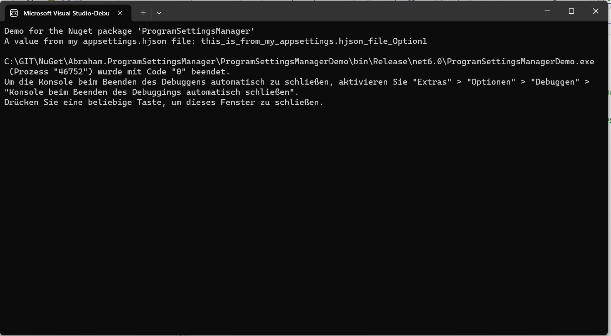

# Abraham.ProgramSettingsManager

    

## OVERVIEW

Enables you to use a JSON file for configuration of your app
(typically appsettings.hjson or appsettings.json).


## License

Licensed under Apache licence.
https://www.apache.org/licenses/LICENSE-2.0


## Compatibility

The nuget package was build with DotNET 6.


## INSTALLATION

Install the Nuget package "Abraham.ProgramSettingsManager" into you application (from https://www.nuget.org).

Add the following code:

```c#
private static ProgramSettingsManager<Configuration> _myConfiguration;

static void Main(string[] args)
{
    // easy version:
    _myConfiguration = new ProgramSettingsManager<Configuration>().Load();
    Console.WriteLine($"A value from my appsettings.hjson file: {_myConfiguration.Data.Option1}");

. . . your code
}

class Configuration
{
    public string Option1 { get; set; }
    public string Option2 { get; set; }
    public string Option3 { get; set; }
}
```

Add a file named "appsettings.hjson" to your project, make sure it's 
copied to the output directory (bin directory) of your app, with this content:

```json
{
    Option1: "my value 1",
    Option2: "my value 2",
    Option3: "my value 3",
}
```

That's it!

For more options, please refer to my Demo application in the github repository (see below).
The Demo and the nuget source code is well documented.


## USING SPECIAL FOLDERS FOR YOUR PROGRAM SETTINGS

You can use method 'UsePathRelativeToSpecialFolder' to set a certain path and filename, 
relative to a known folder.

```c#
    _myConfiguration = new ProgramSettingsManager<Configuration>()
        .UsePathRelativeToSpecialFolder(@"%APPLICATIONDATA%\AcmeCompany\Appsettings.json")
        .Load();
```

More possibilities are:
- %APPLICATIONDATA%\AcmeCompany\Appsettings.json
- %LOCALAPPLICATIONDATA%\AcmeCompany\Appsettings.json
- %COMMONDOCUMENTS%\MyProgram\Appsettings.json
- %MYDOCUMENTS%\MyProgram\Appsettings.json
- %TEMP%\MyProgram\Appsettings.json


## Create a default configuration if the file is missing

You can use method 'CreateIfMissing' before Load to create an empty default instance,
if the configuration file doesn't exist yet.

```c#
    _myConfiguration = new ProgramSettingsManager<Configuration>()
        .CreateIfMissing()
        .Load();
```


## HOW TO INSTALL A NUGET PACKAGE
This is very simple:
- Start Visual Studio (with NuGet installed) 
- Right-click on your project's References and choose "Manage NuGet Packages..."
- Choose Online category from the left
- Enter the name of the nuget package to the top right search and hit enter
- Choose your package from search results and hit install
- Done!


or from NuGet Command-Line:

    Install-Package Abraham.ProgramSettingsManager


## AUTHOR

Oliver Abraham, mail@oliver-abraham.de, https://www.oliver-abraham.de

Please feel free to comment and suggest improvements!


## SOURCE CODE

The source code is hosted at:

https://github.com/OliverAbraham/Abraham.ProgramSettingsManager

The Nuget Package is hosted at: 

https://www.nuget.org/packages/Abraham.ProgramSettingsManager


## SCREENSHOTS

Main screen of the demo:


# MAKE A DONATION !
If you find this application useful, buy me a coffee!
I would appreciate a small donation on https://www.buymeacoffee.com/oliverabraham

<a href="https://www.buymeacoffee.com/app/oliverabraham" target="_blank"></a>
